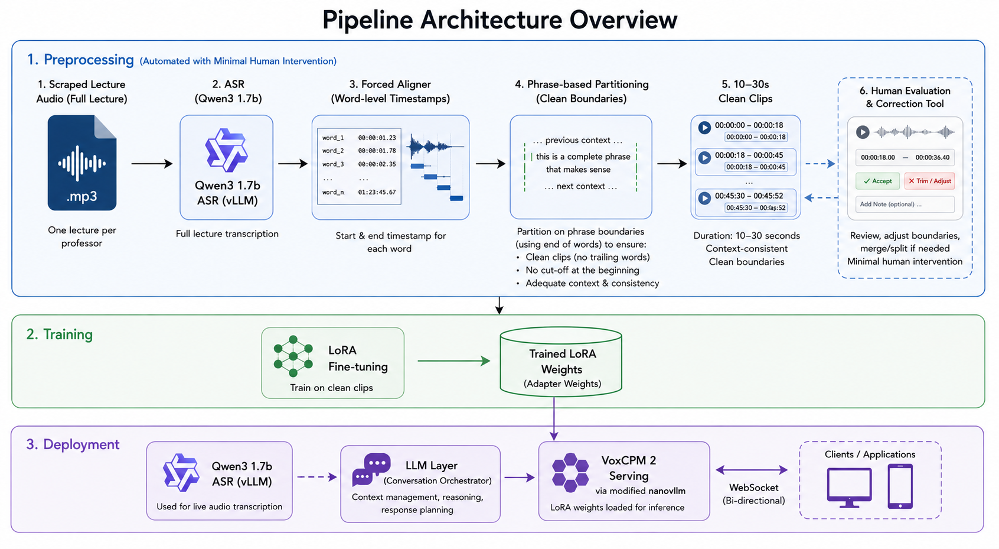
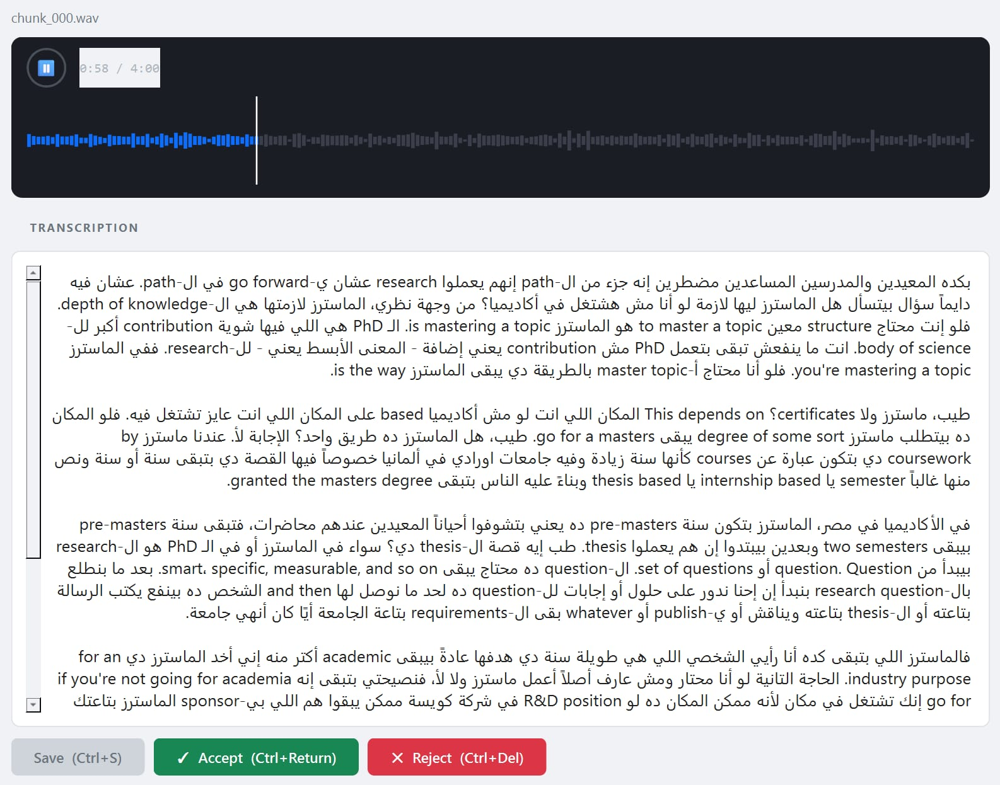
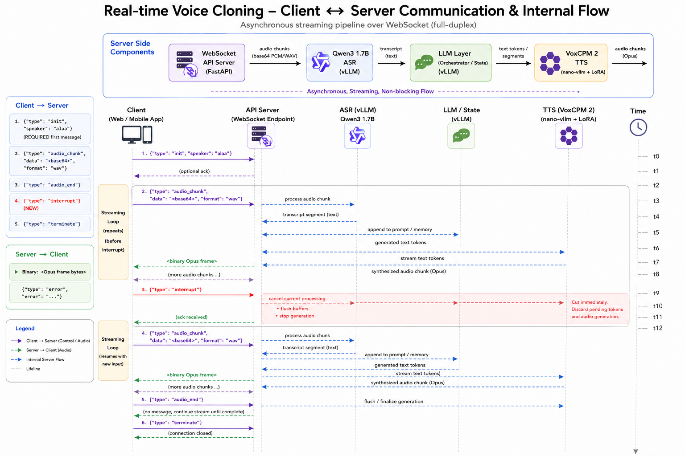

# Conversational Professor Clone - Digital Twin

Welcome to the **Conversational Professor Clone** project! This repository contains the complete pipeline for generating a digital twin of a professor, enabling real-time voice-to-voice bidirectional conversations. The project covers automated data preprocessing, model fine-tuning, and a low-latency asynchronous deployment architecture over WebSockets.

## Table of Contents
- [Pipeline Architecture Overview](#pipeline-architecture-overview)
- [Preprocessing](#preprocessing)
- [Training](#training)
- [Deployment](#deployment)
- [Monitoring](#monitoring)
- [Quickstart & Usage Guide](#quickstart--usage-guide)
## Demo Video

[](https://youtu.be/w5h4kcRGPww)
## Pipeline Architecture Overview





---

## Preprocessing

In the preprocessing phase, we scrape a lecture from each professor and process it through an automated pipeline to create 10-30 second clips with minimal human intervention. 

1. **Transcription & Alignment**: The entire lecture `.mp3` is sent into our ASR model (**Qwen3 1.7b ASR**) coupled with a forced aligner. This yields the exact start and end timestamp for each word.
2. **Smart Partitioning**: Our partition algorithm slices the audio based on the end of words and phrases. This ensures clean clips without any trailing words cut off at the beginning or end, while maintaining context and consistency.
3. **Evaluation**: We utilize a small internal tool for rapid human evaluation and correction.

4. **Dataset**: The processed audio segments can be found at the [ASU Professors Voice Cloning Dataset](https://www.kaggle.com/datasets/ahmednasrii/asu-professors-voice-cloning).



---

## Training

The training step involves fine-tuning the **VoxCPM 2** model using LoRA configs to capture the nuance, tone, and speaking style of the professor. We use the clean segments from the preprocessing pipeline to train lightweight LoRA adapters on A100 gpu instance, for efficiency and fast iteration.


## Deployment

The deployment setup is designed for low latency and full-duplex communication using WebSockets. Both the ASR and TTS backend servers are hosted on a single RTX A6000 on Thunder Compute.

* **Qwen3 1.7b ASR** is served using **vLLM** for highly optimized transcription.
* **VoxCPM 2** is deployed via a self-modified version of **nano-vllm** that supports WebSocket integration. This hosts the base model and the dynamically loaded trained LoRA weights.

### Asynchronous Data Flow

The pipeline operates entirely asynchronously. Audio chunks are streamed from the client directly through the ASR inference, fed to the LLM, and synthesized by VoxCPM immediately to return output chunks to the client.



### API Endpoints
* `WS /stream`: Primary full-duplex endpoint for client-server bidirectional communication. Handles incoming audio bytes and returns synthesized audio bytes and metadata.
* `POST /loras`: Dynamically load or swap LoRA adapters into the TTS pipeline without restarting the server.
* `GET /health`: Basic health check validation for the container orchestration and load balancing.


## Monitoring

Server metrics are gathered from endpoint instrumentation using **Prometheus** and visualized in **Grafana**. This provides deep observability into system usage, latency percentiles, WebSocket connection health, and GPU metrics for the RTX A6000.


---

## Quickstart & Usage Guide

Below is the setup and startup sequence tailored for an Ubuntu VM on Thunder Compute.

### 1. Install Dependencies
Using `uv`, install the required libraries in both the root directory and the deployment directory:
```bash
# In the root directory
uv sync

# In the deployment directory
cd deployment
uv sync
```

### 2. Start the vLLM ASR Server
Run the ASR module from the root virtual environment:
```bash
vllm serve --config qwen3_asr_vllm.yaml
```

### 3. Start the Main FastAPI Server
Activate the environment variables and run the deployment app:
```bash
set -a
source deployment/.env
set +a

uv run fastapi run deployment/app/main.py --host 0.0.0.0 --port 8001
```

### 4. Load the LoRA Adapter dynamically
Once the server is running, load your trained professor twin weights via curl:
```bash
curl -X POST http://localhost:8001/loras \
  -H "Content-Type: application/json" \
  -d '{"name":"my_lora","path":"/home/ubuntu/latest"}'
```

### 5. Run Stress Tests
To benchmark the deployment and test concurrency under load, use the stress testing script provided in the root directory:
```bash
python stress_test.py
```
